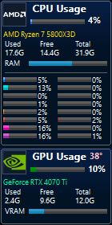

# monitor2

Windows向けの小さなCPU・メモリ・NVIDIA GPUモニターです。

[ダウンロード（Releases）](https://github.com/curi1119/monitor2/releases)

Windows x64用のZIPを展開し、`monitor2.exe`を実行してください。

## 監視できる項目

| 対象 | 表示内容 |
|---|---|
| CPU | 全体・コアごとの使用率 |
| メモリ | 使用量・空き容量・総容量 |
| NVIDIA GPU | 使用率・温度・ビデオメモリ使用量 |

GPUの監視には対応するNVIDIAドライバーが必要です。CPU温度は未対応です。

## 使い方

- Ctrl＋左ドラッグで移動できます。通常の左クリックは背後へ通します。
- 右クリックで「設定」「終了」を選べます。
- 設定ではテーマ、ドラッグ・左クリックスルー、最前面表示、自動起動、更新間隔、コア表示を変更できます。

詳しくは[使用方法と設定](docs/settings.md)を参照してください。
