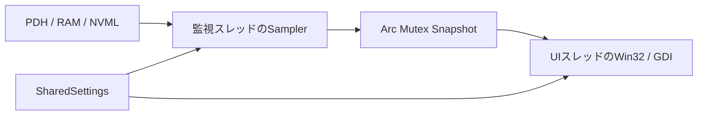

# 構成と設定

## モジュール

| ファイル | 役割 |
|---|---|
| src/main.rs | 引数、起動、共有状態、監視スレッド、終了待ち |
| src/hardware.rs | Snapshot、CPUのPDH、RAM、CPU名、Sampler |
| src/topology.rs | 物理コアと論理CPUの対応、SMT集計 |
| src/nvml.rs | NVMLの動的ロード・ABI、GPU値、ライブラリ寿命 |
| src/ui.rs | Win32メッセージ、トレイ、レイアウト、GDI、DPI |
| src/settings.rs | 設定解析、保存、自動起動、共有設定と待機 |
| src/settings_ui.rs | 設定画面のコントロール、入力検証、保存通知 |
| build.rs | SVGから複数サイズのICO生成、Windowsリソース埋め込み |

実行時のCargo依存はwindows-sysです。embed-resourceとresvgはビルド専用で、常駐中にSVGを解析しません。依存・素材の条件は[THIRD_PARTY_NOTICES.md](../THIRD_PARTY_NOTICES.md)に記録しています。

## データとスレッド

監視スレッドはSamplerとPDH／NVMLハンドルを作成し、取得したSnapshotで共有状態を置き換えます。UIはタイマーでSnapshotをコピーして描画します。API呼び出し中や描画中に共有Snapshotのロックを保持しない設計です。

SharedSettingsは設定値と停止・設定変更の通知を保持します。監視スレッドはCondvarで更新間隔だけ待機し、設定保存や終了通知で待機を解除します。設定変更のたびにスレッドを作り直しません。

## 設定の保存と反映

ユーザー向けの項目・初期値は[settings.md](settings.md)を参照してください。

- 保存先は%LOCALAPPDATA%/monitor2/settings.ini。UTF-8のkey=value形式で、未指定項目は初期値、未知のキーは無視します。不正な既知の値はエラーです。
- 監視間隔は250〜60000ms。画面では秒を入力し、有限値と範囲を検証してmsへ変換します。
- 保存は同じディレクトリの一時ファイルへ書いてrenameします。その後、自動起動のレジストリを変更します。レジストリ変更失敗時は設定ファイルの復元を試みます。
- 自動起動はHKCU/Software/Microsoft/Windows/CurrentVersion/Runのmonitor2値へ、引用符で囲んだ実行ファイルパスを登録します。管理者向け・全ユーザー向けの登録は行いません。
- 起動時の自動起動チェックは、実際のRun値が現在のEXEパスと一致するかで判定します。EXE移動後は設定を保存し直す必要があります。
- 保存成功後に共有設定を更新し、監視スレッドを起こして、UIへ変更メッセージを送ります。UIは最前面・タイマー・コア表示を更新します。

設定画面は既に開いている場合に再利用します。保存・キャンセルで閉じ、終了時は親ウィンドウからも破棄します。保存に失敗した場合は変更を反映せず、エラーを表示します。

## 終了と所有権

UI終了時にタイマー・トレイを解除し、監視スレッドへ停止通知を出してjoinします。PDHクエリはClose、NVMLはShutdown後にDLLを解放し、GDI・所有アイコンはDropで解放します。

Win32ウィンドウプロシージャはUIスレッドだけがApp／Dialogを参照する前提です。CreateWindow、SetWindowPos、SendMessage、DestroyWindowなどは再入し得ます。同期呼び出しをまたいでRustの可変参照を保持しないでください。raw pointerの有効期間・Box所有権の移譲・WM_NCDESTROYでの解放はコードのSAFETYコメントと併せて確認してください。
